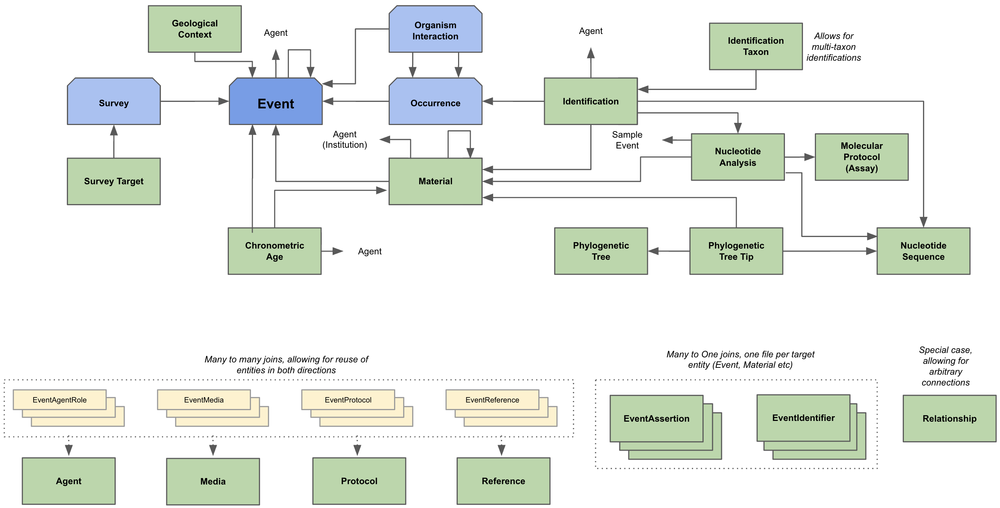
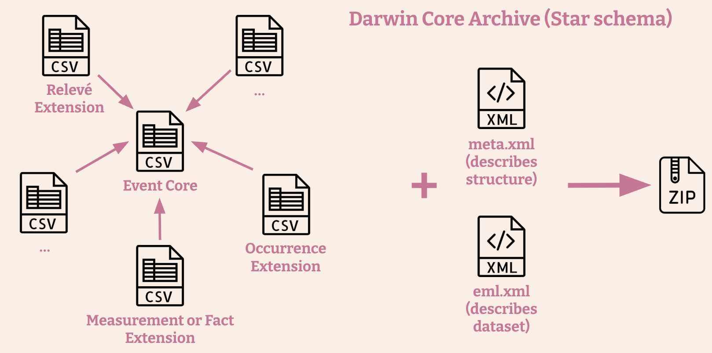
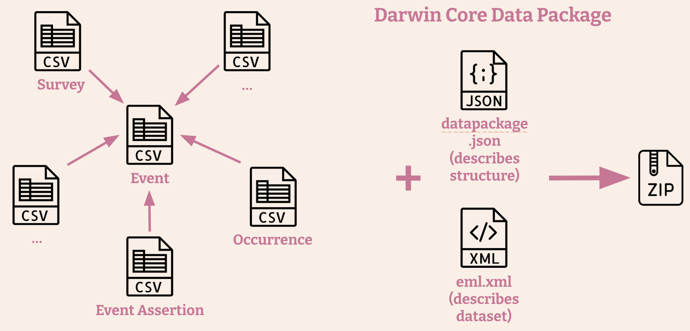

This website contains material to support a proposal for a [Vocabulary Enhancement](https://github.com/tdwg/vocab/blob/master/vms/maintenance-specification.md#4-vocabulary-enhancements) to the [Darwin Core](https://dwc.tdwg.org/) standard. The proposal for the enhancement is scheduled for full **public review beginning 2025-09-01**. The public review will include a [Darwin Core Conceptual Model](#darwin-core-conceptual-model) as a component of a long-awaited Semantic Layer for Darwin Core and a [Darwin Core Data Package (DwC-DP) Publishing Model](#darwin-core-data-package-dwc-dp-publishing-model) that implements the conceptual model and supports sharing deeper and richer data than is possible with a [Darwin Core Archive](https://ipt.gbif.org/manual/en/ipt/latest/dwca-guide). The Semantic Layer will define the explicit relationships between the classes that are seen in DwC-DP and will be based on the understanding of biodiversity-related concepts accumulated in the analysis of myriad use cases during the theoretical Unified Model phase of the project [Diversifying the GBIF Data Model](https://www.gbif.org/new-data-model).

Previous to the public review, we welcome those who are interested to explore the [Darwin Core Data Package (DwC-DP) Publishing Model](#darwin-core-data-package-dwc-dp-publishing-model). This is an opportunity to **test the data publishing model with your real data**. To understand how you can do this, see the [Participating and Getting Help](#participating-and-getting-help) section, below. **This community testing phase will remain open until 2025-08-01**.

## Table of Contents
[Darwin Core Conceptual Model](#darwin-core-conceptual-model)

[Darwin Core Data Package (DwC-DP) Publishing Model](#darwin-core-data-package-dwc-dp-publishing-model)
- [Purpose](#purpose)
- [Structure](#structure)
- [Example Datasets](#example-datasets)

[Implications for Darwin Core](#implications-for-darwin-core)
- [New Classes and Properties](#new-classes-and-properties)
- [Changes to Existing Classes and Properties](#changes-to-existing-classes-and-properties)
  - [Occurrence](#occurrence)

[Participating and Getting Help](#participating-and-getting-help)

# Darwin Core Conceptual Model
The Darwin Core Conceptual Model is based on a distillation of the [GBIF Unified Model](https://www.gbif.org/new-data-model) with an emphasis on practicality for implementations.

Figure 1. Overview of the classes in the Darwin Core Conceptual Model (since 2025-06-02) showing the primary relationships between key biodiversity-related concepts. Information is most commonly organized around Events. Clipped-corner, blue boxes indicate the Event class and extensions to it for different event types (Occurrences, OrganismInteractions, and Surveys). Other types of Events, such as Observation and MaterialGathering, can also be accommodated, but do not require a specific extension beyond the Event. Unclipped, green boxes represent additional classes. Of these, Agent, Media, Protocol, and Reference can be connected to other classes throughout the model (indicated by the "joins" in small, yellow rectangles, e.g., EventAgentRole). Specific kinds of Assertions (e.g., EventAssertion) and Identifiers (e.g., EventIdentifier) can be connected directly to other classes. The Relationship class is provided to capture any relationship between instances of classes in the model that are not already explicitly defined, should that unexpected need arise.

# Darwin Core Data Package (DwC-DP) Publishing Model
## Purpose
The Darwin Core Data Package (DwC-DP) is a data model implementation of the [Darwin Core Conceptual Model](#darwin-core-conceptual-model) to use for sharing biodiversity-related data, including data with structure beyond the restrictions of a [Darwin Core Archive](https://ipt.gbif.org/manual/en/ipt/latest/dwca-guide) star schema, for a wide variety of new and traditional biodiversity data sources. The model fully supports datasets traditionally published as [Darwin Core Archives](https://ipt.gbif.org/manual/en/ipt/latest/dwca-guide) (observations and physical specimens, with extensions), but it goes far beyond, allowing richer data to be shared from these traditional datasets than was hitherto supported. Also, it empowers those who desire to share entirely new types of data (biotic surveys with inferred absence and abundance, hierarchical material entities, organism interactions, phylogenetic trees, and nucleotide analyses, among others) via Darwin Core. 

## Structure
The higher-level structure of a Darwin Core Data Package is based on the [Darwin Core Archive](https://ipt.gbif.org/manual/en/ipt/latest/dwca-guide) - they both encapsulate datasets in text files (CSV, TSV) with dataset metadata in an Ecological Markup Language (EML) document that can be packaged and delivered in a compressed archive file. 

Figure 2. Schematic overview of the structure and content of a Darwin Core Archive. CSV files contain the primary data for a dataset, centered around a 'core' table, with optional 'extensions' connected directly to that core (the 'star schema'). The structure of these files and the relationships between them is captured on the meta.xml file. The eml.xml file contains the dataset metadata in Ecological Markup Language (EML). All of these are compressed in the Darwin Core Archive.

Figure 3. Schematic overview of the structure and content of a Darwin Core Data Package corresponding to the same theoretical dataset as for the Darwin Core Archive in Figure 2. In place of the meta.xml file to describe a core and extensions, the datapackage.json file describes the CSV files, the relationships between them, the fields included in each CSV file, their definitions, constraints, etc. With the exception that the structure is not limited by the 'star schema' and the structure being described in the datapackage.json file, everything else about the Darwin Core Archives and Darwin Core Data Packages is the same.

The biggest difference between a Darwin Core Archive and a Darwin Core Data Package is in the extent to which the data within distinct classes can be stored and shared in distinct text files, and how these files relate to each other. The list of fields and all of their details (including names, labels, definitions, usage comments, examples, and constraints) are defined in the JSON [table schema](https://github.com/gbif/dwc-dp/tree/master/dwc-dp/0.1/table-schemas) files. The details of the relationships between files are also in the table schemas, expressed as primary keys (unique identifiers within a table) and foreign keys (fields that contain the identifiers equal to the value of a primary key in another file).

The beauty of DwC-DP is that it is complicated only for those who want or need it to be, because there is no other way to faithfully capture the complexity of their data. Just as with Darwin Core Archives, a [test version](https://dwcdp-ipt.gbif-test.org/) of the GBIF Integrated Publishing Toolkit (IPT) in development can facilitate data structure mapping and produce Darwin Core Data Packages. If you would like to test structuring your data as a Darwin Core Data Package with this test IPT (not for production use), please contact the DwC-DP helpdesk at [dwcdp@gbif.org](mailto:dwcdp@gbif.org)

## Example Datasets
There is a separate GitHub repository ([gbif/dwc-dp-examples](https://github.com/gbif/dwc-dp-examples)) in which we have been accumulating examples of real datasets mapped to DwC-DP. That repository contains a representation of the DwC-DP as a [database schema](https://github.com/gbif/dwc-dp-examples/blob/master/gbif/dwc_dp_schema.sql) that can be populated with data mapped to DwC-DP and checked for data integrity.

# Implications for Darwin Core
Including the Darwin Core Data Package as a vocabulary enhancement to the Darwin Core standard implies several changes in the standard, including adding terms, modifying existing terms, and providing new documentation accordingly. Two new normative documents will be needed. The first will be a document describing in detail the Darwin Core Semantic Layer, including the [Darwin Core Conceptual Model](#darwin-core-conceptual-model), of which the DwC-DP is an implementation. The second document will be a "Darwin Core Data Package Guide". Much like the [Darwin Core Text Guide](https://dwc.tdwg.org/text/), this second document will describe the requirements for the structure of Darwin Core as a Data Package.

## New Classes and Properties
To enable the Darwin Core Data Package, new terms will have to be added. These include new classes and new properties in those classes. New classes are described below. To explore all classes and their properties in detail, see the [Darwin Core Data Package - Quick Reference Guide](https://gbif.github.io/dwc-dp/qrg/).

**Agent** - A person, group, organization or other entity that can act.

**IdentificationTaxon** - A construct of components and positions of dwc:scientificNames in a dwc:Identification.

**Media** - A dcmi:MediaType (dcmi:Sounds, dcmi:StillImages, dcmi:MovingImages or dcmi:Text) with other entities as content. This class accommodates metadata about media from the [Audiovisual Core](https://ac.tdwg.org/) standard.

**MolecularProtocol** - A protocol used to derive and identify a nucleotide sequence from a dwc:MaterialEntity. This class accommodates the [DNA derived data](https://rs.gbif.org/extension/gbif/1.0/dna_derived_data_2024-07-11.xml) Extension.

**NucleotideAnalysis** - A link between a NucleotideSequence and a dwc:Event and a dwc:MaterialEntity from which it was derived, using a specified Protocol.

**NucleotideSequence** - A digital representation of a nucleotide sequence.

**OrganismInteraction** - An interaction between two dwc:Organisms during a dwc:Event.

**PhylogeneticTree** - A branching diagram that shows the evolutionary relationships between dwc:Organisms.

**PhylogeneticTreeTip** - A group of Taxa at the end of a branch of a PhylogeneticTree as determined from relationships between dwc:Organisms.

**Protocol** - A method used during an action.

**Reference** - A bibliographic reference in which an entity is mentioned.

**Survey** - A biotic survey. This class accommodates the [Humboldt Extension for Ecological Inventories](https://eco.tdwg.org/).

**SurveyTarget** - A specification of a characteristic of a dwc:Occurrence that was included or excluded in a Survey. This class accommodates and extended the Scope aspects of the [Humboldt Extension for Ecological Inventories](https://eco.tdwg.org/).

## Changes to Existing Classes and Properties
The Darwin Core Data Package, backed by the semantics embodied in the [Darwin Core Conceptual Model](#darwin-core-conceptual-model), clarifies many of the ambiguities that existed in Darwin Core previously. Some of these ambiguities are mitigated by assigning existing properties to different classes. Other clarifications are made by adding new properties to existing Darwin Core classes and improving definitions, usage comments and examples of existing Darwin Core terms (classes and properties).

### Occurrence
One of the most fundamental advances of the Semantic Layer, reflected in the DwC-DP publishing model, is the disambiguation of the dwc:Occurrence class. Previously, in practice, a dwc:Occurrence was a catch-all for information in support of the existence of a dwc:Organism at a place and time. Under DwC-DP, a dwc:Occurrence is "A state of a dwc:Organism in a dwc:Event." Thus, the material evidence, though it can support the validity of a dwc:Occurrence, is not a property of the Occurrence. Instead, all of the ephemeral characteristics of the state of an Organism are properties of a dwc:Occurrence. In short, the dwc:Occurrence now clearly consists of the things about a dwc:Organism at a given place and time that were observed or inferred.

# Participating and Getting Help
In anticipation of a formal public review, scheduled to begin 2025-09-01, we would like to invite people to gain familiarity with and test the DwC-DP by attempting to map original datasets to it. We are just beginning to work on the "Darwin Core Data Package Guide", which is intended to contain various "recipes" for publishing different types of datasets. Until that document contains useful content, the best way forward is to look at an already-mapped example dataset that is similar to the one you want to test ([gbif/dwc-dp-examples](https://github.com/gbif/dwc-dp-examples)). This community testing phase will remain open until 2025-08-01.

- **Getting started** - In addition to this document, the easiest way to start to understand DwC-DP is to look at the [Darwin Core Data Package - Quick Reference Guide](https://gbif.github.io/dwc-dp/qrg/index.html).

- **Mapping datasets to DwC-DP** - If you need help getting started with mapping a dataset to DwC-DP, see the [Data Mapping Guide](https://gbif.github.io/dwc-dp-examples/data-mapping-guide.html). For feedback about the Guide or any of the [DwC-DP Examples](https://github.com/gbif/dwc-dp-examples/), feel free to register an [Issue](https://github.com/gbif/dwc-dp-examples/issues).

- **Testing with IPT** - If you are interested in using the [test instance](https://dwcdp-ipt.gbif-test.org/) of the Integrated Publishing Toolkit  (not for production use) to produce a Darwin Core Data Package, please contact the DwC-DP helpdesk to set up an account. 

- **Submitting Issues** - For feedback about the structure or documentation of DwC-DP, feel free to register an [Issue](https://github.com/gbif/dwc-dp/issues).

- **Discussion** - For open discussion on the Darwin Core Data Package, see the GBIF [Darwin Core Data Package (DwC-DP) discourse forum topic](https://discourse.gbif.org/t/darwin-core-data-package-dwc-dp/5937).

- **Help!** - For help with any issue, feel free to contact the DwC-DP helpdesk [dwcdp@gbif.org](dwcdp@gbif.org).
