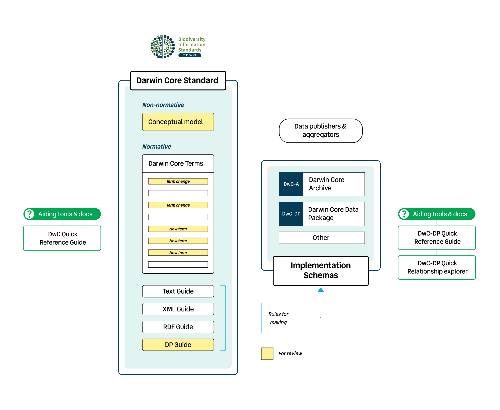

## Introduction

{:.lead}
The members of the [Darwin Core Maintenance Group](https://www.tdwg.org/community/dwc/) would like to welcome you to the **public review for the set of proposed changes to Darwin Core** described below. The proposed changes are developed to support richer, more complex types of biodiversity data than what is currently possible with a Darwin Core Archive.

This review is distinctive from previous maintenance reviews in that it includes many term changes and addition of documentation to the Darwin Core standard, hence the minimum review period is set to be a minimum of 90 days rather than the customary minimum 30 days.

Below you will find a summary of the proposals under review and the relevant links to participate in this community process.

{:.alert .alert-info}
Your comments are welcome and important for the evolution of the Darwin Core standard. [See below](#participate) how you can participate.

## What is under review?

This is not a proposal for a new standard. Instead, this proposal contains material for a [Vocabulary Enhancement](https://github.com/tdwg/vocab/blob/master/vms/maintenance-specification.md#4-vocabulary-enhancements) of the existing [Darwin Core](https://dwc.tdwg.org/) standard. Under consideration are **three items** (see Figure 1):

1. [**Darwin Core Conceptual Model**](#cm): a new specification for a non-normative "semantic layer" for Darwin Core.

2. [**Darwin Core Data Package guide**](#dp): a new specification for creating Darwin Core datasets as Frictionless Data Packages. It is one implementation of the conceptual model.

3. [**Changes to Darwin Core terms**](#term-changes): proposals for new terms and changes to existing terms, mainly to clarify semantics and support the above.

_Figure 1: Overview of the public review that includes the Darwin Core Conceptual Model, the Darwin Core Data Package guide, and proposals for new and changes to existing Darwin Core terms._

{:id="cm"}
### Darwin Core Conceptual Model

[Explore the model](cm/){:.btn .btn-primary}

The **Darwin Core Conceptual Model (DwC-CM)** provides a high‑level framework that describes explicit relationships between Darwin Core classes in typical biodiversity information workflows. DwC-CM is a synthesis of years of discussion and contributions to Biodiversity Information Standards (TDWG) Interest Groups. The synthesis arose during research towards [“Diversifying the GBIF Data Model”](https://www.gbif.org/new-data-model), which brought additional perspectives from the GBIF community and included a series of iterative approaches to refine and validate both a conceptual model and a data publishing model through a wide variety of biodiversity data use cases. Data structures of many operational systems, including all commonly used open source collection management systems, have been studied and have influenced this model.

{:id="dp"}
### Darwin Core Data Package guide

[Read the guide](dp/){:.btn .btn-primary}

The **Darwin Core Data Package guide** is a specification for creating “Darwin Core Data Packages” (DwC-DP): an exchange format for biodiversity data. It extends the [Data Package specification](https://specs.frictionlessdata.io/) (developed by Frictionless Data) as an implementation for the Darwin Core Conceptual Model. It is similar in purpose to the [Darwin Core Text guide](https://dwc.tdwg.org/text/), which is a specification for Darwin Core Archives.

The Darwin Core Data Package guide references a [DwC-DP profile](dp/#32-package-level-properties) and [table schemas](dp/#dwc-dp-tables), but these are not part of the public review, because the standard does not include those implementation schemas. Nevertheless, it is extremely useful for understanding how the Conceptual Model and Data Package specification would be put into practice. It is the application of the theory.

{:id="term-changes"}
### Changes to Darwin Core terms

[See suggested changes](https://github.com/tdwg/dwc/milestone/20){:.btn .btn-primary}
[Explore all classes and terms](qrg/){:.btn .btn-outline-primary}

#### New classes and properties

To enable an implementation of a Darwin Core Data Package as a new publishing model, new terms are being added to Darwin Core and many others are being borrowed from other standard vocabularies. These additions include new classes and new properties in those classes. The list of new classes under consideration for public review are described below. To explore all classes and their properties in detail, see the [Darwin Core Data Package - Quick Reference Guide](qrg/). For a list of proposals for new class terms, see the issues [labeled with "new" and "class"](https://github.com/tdwg/dwc/issues?q=state%3Aopen%20label%3Aclass%20label%3Anew). Proposals for new properties can be found in the lists of subissues for individual classes via [Issue Summaries](https://github.com/tdwg/dwc/issues?q=state%3Aopen%20label%3A%22Issue%20Summary%22).

#### Changes to existing classes and properties

The semantics of the [Darwin Core Conceptual Model](#dwc-cm), and their implementation through the [Darwin Core Data Package publishing model](qrg/), clarify many of the ambiguities that existed in Darwin Core previously. Changes needed to mitigate these ambiguities include assigning existing properties to different classes and improving definitions, usage comments and examples of existing Darwin Core terms (both classes and properties). For a list of proposals for changes to existing Darwin Core terms, see the issues [labeled with "change" and "class"](https://github.com/tdwg/dwc/issues?q=state%3Aopen%20label%3Aclass%20label%3Achange). Proposals for changes to existing properties can be found in the lists of subissues for individual classes in [Issue Summaries](https://github.com/tdwg/dwc/issues?q=state%3Aopen%20label%3A%22Issue%20Summary%22).

##### Occurrence

One of the most fundamental advances of the Semantic Layer, reflected in the DwC-DP publishing model, is the disambiguation of the `dwc:Occurrence` class. Previously, in practice, a `dwc:Occurrence` was a catch-all for information in support of the existence of a `dwc:Organism` at a place and time. Under DwC-CM, a `dwc:Occurrence` is "A state of a `dwc:Organism` in a `dwc:Event`." Thus, material evidence, though it can support the validity of a `dwc:Occurrence`, does not consist of properties of the `dwc:Occurrence`. Instead, all of the ephemeral characteristics of the state of a `dwc:Organism` are properties of a `dwc:Occurrence`, while the permanent characteristics remain properties of the `dwc:Organism`. In short, the `dwc:Occurrence` now consists of the changeable things about a `dwc:Organism` that was observed or inferred at a given place and time.

{:id="participate"}
## Participating in the review

Thank you for considering to review (parts of) this proposal! If you have:

1. **Feedback on the Darwin Core Conceptual Model**: follow [these instructions](https://github.com/tdwg/dwc/issues/728).

2. **Feedback on the Darwin Core Data Package guide**: follow [these instructions](https://github.com/tdwg/dwc/issues/727).

3. **Feedback on the changes to Darwin Core terms**: these are submitted as separate issues in the Darwin Core GitHub repository. Please [look for the issue](https://github.com/tdwg/dwc/issues?q=is%3Aissue%20state%3Aopen%20milestone%3A%22DwC-DP%20Issues%22) related to your term you want to provide feedback for and add a comment to the issue.

## Who's behind this?

This proposal was developed by representives from the [Darwin Core Maintenance Group](https://www.tdwg.org/community/dwc/) and the [Global Biodiversity Information Facility (GBIF)](http://www.gbif.org), using numerous use cases submitted by third parties.

The proposal is the result of an iterative and open approach. Whether you were involved in this process or not, everyone welcome to review.

Information about efforts related to the development of this proposal can be found in the [Darwin Core Data Package (DwC-DP) Implementation Experience and Feature Report](docs/dwc_dp_implementation_feature_reports.pdf).
