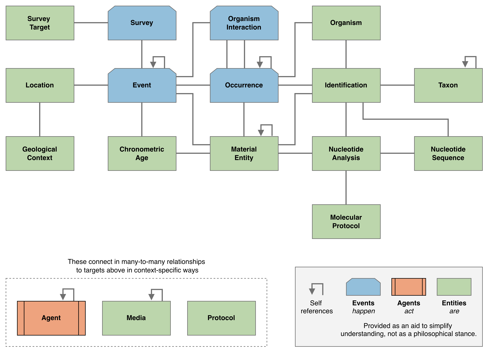

This document contains material to support a proposal for a [Vocabulary Enhancement](https://github.com/tdwg/vocab/blob/master/vms/maintenance-specification.md#4-vocabulary-enhancements) to the [Darwin Core](https://dwc.tdwg.org/) standard. 

The public review covers (see Figure 1):
  - a [Darwin Core Conceptual Model](#darwin-core-conceptual-model) (DwC-CM, a "semantic layer" for Darwin Core), 
  - a [Darwin Core Data Package Guide](https://github.com/gbif/dwc-dp/blob/master/darwin-core-data-package-guide.md) (a specification for Darwin Core Data Packages),
  - a set of proposals for new terms and changes to existing terms in Darwin Core to support an implementation of the Darwin Core Data Package specification - the [Darwin Core Data Package Publishing Model](#darwin-core-data-package-dwc-dp-publishing-model) (DwC-DP).
  - NOTE: The public review does NOT cover the Darwin Core Data Package Publishing Model itself.

Information about efforts related to the development of the DwC-CM, the DwC-DP specification, and the DwC-DP Publishing Model can be found in the [Darwin Core Data Package (DwC-DP) Implementation Experience and Feature Report]().

_Figure 1. Overview of the public review that includes the Darwin Core Conceptual Model (DwC-CM), the Darwin Core Data Package Guide, and proposals for new and changes Darwin Core terms._

## Darwin Core Conceptual Model

DwC-CM describes explicit relationships between Darwin Core classes based on [research to diversify the GBIF Data Model](https://www.gbif.org/new-data-model) that began in July 2021 and that was based on the analysis of a wide variety of biodiversity-related use cases. 

_Figure 2. Overview of the Darwin Core Conceptual Model showing key relationships between fundamental biodiversity-related concepts. Information is most commonly organized around Events. Clipped-corner, blue boxes indicate the Event class and extensions to it for different event types (Occurrences, OrganismInteractions, and Surveys). Other types of Events, such as Observation and MaterialGathering, can also be accommodated, but do not require a specific extension beyond the Event. Unclipped, green boxes represent additional classes. Of these, Agent, Media, Protocol, and Reference can be connected to other classes throughout the model (indicated by the "joins" in small, yellow rectangles, e.g., EventAgentRole). Specific kinds of Assertions (e.g., EventAssertion) and Identifiers (e.g., EventIdentifier) can be connected directly to other classes. The Relationship class is provided to capture any relationship between instances of classes in the model that are not already explicitly defined, should that unexpected need arise._

## Darwin Core Data Package Guide

The Darwin Core Data Package Guide is a specification of the requirements for a data package to be a Darwin Core Data Package. It is similar in purpose to the [Darwin Core Text Guide](https://dwc.tdwg.org/text/). Both describe specifications for data publishing models. The Darwin Core Data Package Guide is to a Darwin Core Data Package as the Darwin Core Text Guide is to a Darwin Core Archive.

### New Classes and Properties

To enable the Darwin Core Data Package as a new publishing model, new terms will have to be added to Darwin Core. These include new classes and new properties in those classes. New classes are described below. To explore all classes and their properties in detail, see the [Darwin Core Data Package - Quick Reference Guide](/dwc-dp/qrg/).

**Agent** - A person, group, organization or other entity that can act.

**Media** - A `dcmi:MediaType` (`dcmi:Sounds`, `dcmi:StillImages`, `dcmi:MovingImages` or `dcmi:Text`) with other entities as content. This class accommodates metadata about media from the [Audiovisual Core](https://ac.tdwg.org/) standard.

**MolecularProtocol** - A protocol used to derive and identify a nucleotide sequence from a `dwc:MaterialEntity`. This class accommodates the [DNA derived data](https://rs.gbif.org/extension/gbif/1.0/dna_derived_data_2024-07-11.xml) Extension.

**NucleotideAnalysis** - A link between a NucleotideSequence and a `dwc:Event` and a `dwc:MaterialEntity` from which it was derived, using a specified Protocol.

**NucleotideSequence** - A digital representation of a nucleotide sequence.

**OrganismInteraction** - An interaction between two `dwc:Organisms` during a `dwc:Event`.

**Protocol** - A method used during an action.

**Provenance** - Information about an entity’s origins.

**BibliographicResource** - A book, article, or other documentary resource.

**Survey** - A biotic survey or inventory. This class accommodates the [Humboldt Extension for Ecological Inventories](https://eco.tdwg.org/).

**SurveyTarget** - A specification of a characteristic of a `dwc:Occurrence` that was included or excluded in a Survey. This class accommodates and extended the Scope aspects of the [Humboldt Extension for Ecological Inventories](https://eco.tdwg.org/).

**UsagePolicy** - Information about rights, usage, and attribution statements applicable to an entity.

### Changes to Existing Classes and Properties

The Darwin Core Data Package, backed by the semantics embodied in the [Darwin Core Conceptual Model](#darwin-core-conceptual-model), clarifies many of the ambiguities that existed in Darwin Core previously. Some of these ambiguities are mitigated by assigning existing properties to different classes. Other clarifications are made by adding new properties to existing Darwin Core classes and improving definitions, usage comments and examples of existing Darwin Core terms (classes and properties).

#### Occurrence

One of the most fundamental advances of the Semantic Layer, reflected in the DwC-DP publishing model, is the disambiguation of the `dwc:Occurrence` class. Previously, in practice, a `dwc:Occurrence` was a catch-all for information in support of the existence of a `dwc:Organism` at a place and time. Under DwC-DP, a `dwc:Occurrence` is "A state of a `dwc:Organism` in a `dwc:Event`." Thus, the material evidence, though it can support the validity of a `dwc:Occurrence`, is not a property of the Occurrence. Instead, all of the ephemeral characteristics of the state of an Organism are properties of a `dwc:Occurrence`. In short, the `dwc:Occurrence` now clearly consists of the things about a `dwc:Organism` at a given place and time that were observed or inferred.

## Participating and Getting Help

- **Getting started** - In addition to this document, the easiest way to start to understand DwC-DP is to look at the [Darwin Core Data Package - Quick Reference Guide](/dwc-dp/qrg/index.html).

- **Submitting Issues** - For feedback about the structure or documentation of DwC-DP, feel free to register an [Issue](https://github.com/gbif/dwc-dp/issues).

- **Help!** - For help with any issue, feel free to contact the DwC-DP helpdesk <dwcdp@gbif.org>.
